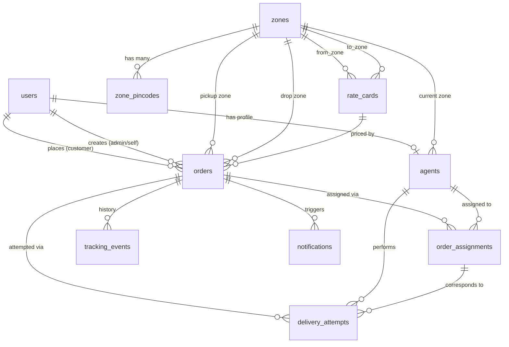

# 🚚 Last-Mile Delivery Tracker

> A full-stack delivery management platform with role-based dashboards, intelligent agent assignment, zone-based rate calculation, and real-time order tracking.


---

## 🚀 Live Demo

<div align="center">

### **[→ https://last-mile-lyart.vercel.app/login](https://last-mile-lyart.vercel.app/login)**

*Deployed on Vercel (frontend) · Render (backend API) · Supabase (PostgreSQL database)*

</div>

---

**Quick Navigation:** [Setup Guide](#setup-guide) · [API Docs](#api-documentation) · [DB Schema](#database-schema) · [Rate Logic](#rate-calculation-logic) · [Deployment](#deployment)

**Repository:** [github.com/Darshil-Ag/last_mile](https://github.com/Darshil-Ag/last_mile)

---

## Project Overview

Last-Mile Delivery Tracker is a delivery operations platform built for three user roles:

| Role | Capabilities |
|---|---|
| **Customer** | Register, place orders, calculate estimated shipping cost, track orders in real-time, reschedule failed deliveries |
| **Delivery Agent** | View assigned orders, update delivery status at each stage, toggle availability |
| **Admin** | Manage all orders, assign/reassign agents (auto or manual), configure zones, rate cards, COD surcharges, and override any order status |

Shipping charges are calculated automatically at order creation using a configurable zone-based rate engine — no hardcoded pricing anywhere in the codebase.

---

## Features

- **Order Creation** — customers place orders with full address, dimensions, and weight; charges are computed and locked at confirmation
- **Rate Calculator** — public pre-login calculator lets users estimate cost before signing up
- **Zone-Based Rate Engine** — pickup and drop pincodes resolve to admin-defined zones; rates differ by zone pair, order type (B2B/B2C), and direction
- **Volumetric Weight Billing** — billing uses the higher of actual weight vs. volumetric weight `(L×B×H÷5000)`
- **B2B / B2C Rate Cards** — separate rate card entries per zone pair and order type, with validity date ranges
- **COD Surcharge** — configurable as a flat fee or percentage of base charge; only applies to Cash-On-Delivery orders
- **Auto Agent Assignment** — selects the best available agent using a two-tier algorithm: in-zone proximity first, cross-zone fallback with audit reason
- **Manual Agent Assignment** — admins can override auto-selection and assign any available agent
- **Status Lifecycle Tracking** — enforced state machine with 8 statuses; every change appended to an immutable `tracking_events` table
- **Failed Delivery + Reschedule Flow** — customers reschedule from the dashboard; system auto-assigns a new agent for the chosen date
- **Email Notifications** — transactional emails sent via [Resend](https://resend.com) on every status change (order created, assigned, picked up, out for delivery, delivered, failed, rescheduled)
- **Admin Dashboard** — filterable orders table with status/zone/agent filters, agent management, zone and rate card CRUD
- **Public Order Tracking** — unauthenticated tracking via order number + phone (rate-limited: 10 req/min per IP)
- **Session Security** — JWT-based auth stored in `sessionStorage`; auto-logout on tab close or refresh

---

## Tech Stack

| Layer | Technology |
|---|---|
| **Frontend** | React 18, Vite 5, React Router v6, Axios, Vanilla CSS |
| **Backend** | Node.js 18+, Express 4, nodemon (dev) |
| **Database** | PostgreSQL via Supabase (`@supabase/supabase-js`) |
| **Authentication** | Custom JWT (`jsonwebtoken`), bcrypt password hashing |
| **Email Notifications** | Resend API (`resend`) |
| **Frontend Hosting** | Vercel (SPA with rewrite rules) |
| **Backend Hosting** | Render |
| **Database Hosting** | Supabase |

---

## Setup Guide

### Prerequisites

- **Node.js** ≥ 18.x
- A **Supabase** project with the schema applied (see [Database Schema](#database-schema))
- A **Resend** account for email (optional — emails will fail gracefully if not set)

### 1. Clone the repository

```bash
git clone https://github.com/Darshil-Ag/last_mile.git
cd last_mile
```

### 2. Install dependencies

```bash
# Backend
cd server && npm install

# Frontend
cd ../client && npm install
```

### 3. Apply the database schema

In your Supabase project, open the **SQL Editor** and run the entire contents of [`schema.sql`](./schema.sql). Optionally run [`seed.sql`](./seed.sql) to load sample zones, rate cards, and users.

### 4. Configure environment variables

**Backend** — create `server/.env`:

```env
# ── Server ────────────────────────────────────────────────────
PORT=4000
NODE_ENV=development

# ── Supabase ──────────────────────────────────────────────────
# Found in: Supabase Dashboard → Project Settings → API
SUPABASE_URL=https://your-project-id.supabase.co
SUPABASE_SERVICE_ROLE_KEY=your-service-role-key   # Keep secret — bypasses RLS

# ── JWT ───────────────────────────────────────────────────────
JWT_SECRET=your-super-secret-jwt-key-min-32-chars
JWT_EXPIRES_IN=8h

# ── Resend (Email) ────────────────────────────────────────────
# Create a free account at https://resend.com
RESEND_API_KEY=re_your_resend_api_key
# Must be a verified sender domain in your Resend account
EMAIL_FROM=noreply@yourdomain.com

# ── CORS ──────────────────────────────────────────────────────
# Comma-separated list of allowed frontend origins
FRONTEND_URL=http://localhost:5173
```

**Frontend** — create `client/.env`:

```env
# ── API Base URL ──────────────────────────────────────────────
# Leave blank to use Vite's dev proxy (vite.config.js → proxy)
# Set to your deployed backend URL for production
VITE_API_BASE_URL=https://your-render-backend.onrender.com
```

### 5. Run locally

```bash
# Terminal 1 — Backend API (port 4000)
cd server && npm run dev

# Terminal 2 — Frontend dev server (port 5173)
cd client && npm run dev
```

Open [http://localhost:5173](http://localhost:5173).

---

## Database Schema

The schema is defined in [`schema.sql`](./schema.sql) and targets PostgreSQL (via Supabase).

### Tables

| Table | Description |
|---|---|
| `users` | All users — customers, agents, and admins. Stores `role`, `email`, `password_hash`, and `phone`. |
| `zones` | Admin-configured delivery zones with a unique `code`. |
| `zone_pincodes` | Maps individual pincodes to a zone (one-to-many). One pincode belongs to exactly one zone. |
| `rate_cards` | Pricing rules per `from_zone × to_zone × order_type` pair. Stores `base_price`, `rate_per_kg`, `min_chargeable_kg`, and validity window. |
| `cod_surcharge_configs` | COD surcharge settings per order type. Type is `FIXED` (flat ₹ amount) or `PERCENTAGE` (% of base charge). |
| `agents` | Extends `users` with delivery-specific fields: `current_zone_id`, `latitude`, `longitude`, `availability_status` (`AVAILABLE / BUSY / OFFLINE`). |
| `orders` | Core transaction record. Stores full pricing audit (`base_charge`, `cod_surcharge`, `total_charge`, `rate_card_id`) at the moment of confirmation — never recalculated. |
| `order_assignments` | Complete history of agent assignments. Never overwritten — superseded assignments get `unassigned_at` set. Type: `AUTO / MANUAL / RESCHEDULE`. |
| `delivery_attempts` | Tracks each physical delivery attempt with `attempt_number`, `scheduled_date`, `status`, and `failure_reason`. |
| `tracking_events` | **Immutable, append-only** order history. Every status change inserts a new row with `status`, `actor_id`, `actor_role`, `latitude`, `longitude`, `remarks`, and `created_at`. A DB trigger **blocks all UPDATE and DELETE** operations on this table. A second trigger auto-syncs `orders.current_status` on every insert. |
| `notifications` | Email delivery log — stores `channel`, `event_type`, `message`, `status` (`PENDING / SENT / FAILED`), and template `metadata` (JSONB). |

### Entity Relationship Diagram



---

## Rate Calculation Logic

All pricing is read from the database at runtime. **Zero rates are hardcoded** in application code.

### Step-by-Step

**Step 1 — Zone Resolution**
```
pickup_pincode → zone_pincodes table → pickup_zone
drop_pincode   → zone_pincodes table → drop_zone
```
Returns a `422` error if either pincode is not mapped to any zone.

**Step 2 — Volumetric Weight**
```
volumetric_weight_kg = (length_cm × breadth_cm × height_cm) / 5000
```

**Step 3 — Chargeable Weight**
```
chargeable_weight_kg = max(actual_weight_kg, volumetric_weight_kg)
```

**Step 4 — Rate Card Lookup**
```sql
SELECT * FROM rate_cards
WHERE from_zone_id = <pickup_zone_id>
  AND to_zone_id   = <drop_zone_id>
  AND order_type   = <'B2B' | 'B2C'>
  AND is_active    = true
  AND effective_from <= NOW()
  AND (effective_to IS NULL OR effective_to >= NOW())
ORDER BY effective_from DESC
LIMIT 1
```
Returns a `422` error if no matching active rate card exists.

**Step 5 — Base Charge**
```
billable_weight = max(chargeable_weight_kg, rate_card.min_chargeable_kg)
base_charge     = rate_card.base_price + (billable_weight × rate_card.rate_per_kg)
```

**Step 6 — COD Surcharge** *(only when `payment_type = 'COD'`)*
```
if surcharge_type == 'FIXED':       cod_surcharge = surcharge_value
if surcharge_type == 'PERCENTAGE':  cod_surcharge = (base_charge × surcharge_value) / 100
```

**Step 7 — Total**
```
total_charge = base_charge + cod_surcharge
```

The complete breakdown (`volumetric_weight_kg`, `chargeable_weight_kg`, `base_charge`, `cod_surcharge`, `total_charge`, `rate_card_id`) is stored on the `orders` record at confirmation time and **never recalculated** — ensuring a permanent pricing audit trail.

---

## API Documentation

All endpoints are prefixed with `/api`. JWT required unless marked **Public**.

### Auth

| Method | Route | Auth | Description |
|---|---|---|---|
| `POST` | `/auth/register` | Public | Register a new customer account |
| `POST` | `/auth/login` | Public | Login and receive JWT token |
| `GET` | `/auth/me` | JWT | Get current user profile |

### Orders

| Method | Route | Auth | Description |
|---|---|---|---|
| `POST` | `/orders/calculate` | JWT | Preview charge without creating order |
| `POST` | `/orders` | JWT | Create and confirm an order |
| `GET` | `/orders/mine` | CUSTOMER | List own orders |
| `GET` | `/orders/:id` | JWT | Get single order with full tracking history |
| `GET` | `/orders` | ADMIN | List all orders (filterable by status, zone, agent) |
| `POST` | `/orders/:id/assign` | ADMIN | Auto or manually assign a delivery agent |
| `PUT` | `/orders/:id/status` | AGENT / ADMIN | Advance order status; logs tracking event |
| `POST` | `/orders/:id/reschedule` | CUSTOMER / ADMIN | Reschedule a FAILED order |
| `GET` | `/orders/track` | **Public** | Track by order number + phone (rate-limited) |

### Agents

| Method | Route | Auth | Description |
|---|---|---|---|
| `GET` | `/agents` | ADMIN | List all agents with filters |
| `POST` | `/agents` | ADMIN | Create a new agent profile |
| `GET` | `/agents/me` | AGENT | Get own profile |
| `PUT` | `/agents/me/location` | AGENT | Update GPS coordinates |
| `PUT` | `/agents/me/availability` | AGENT | Toggle AVAILABLE / OFFLINE |
| `GET` | `/agents/me/orders` | AGENT | Get active assigned orders |
| `PUT` | `/agents/:id` | ADMIN | Update agent details / zone |
| `PATCH` | `/agents/:id/deactivate` | ADMIN | Deactivate agent |
| `PATCH` | `/agents/:id/reactivate` | ADMIN | Reactivate agent |

### Zones

| Method | Route | Auth | Description |
|---|---|---|---|
| `GET` | `/zones` | JWT | List all active zones |
| `POST` | `/zones` | ADMIN | Create zone |
| `PUT` | `/zones/:id` | ADMIN | Update zone |
| `POST` | `/zones/:id/pincodes` | ADMIN | Add pincodes to zone |
| `DELETE` | `/zones/:id/pincodes/:pid` | ADMIN | Remove a pincode |
| `GET` | `/zones/lookup?pincode=` | JWT | Resolve a single pincode to its zone |

### Rate Cards & COD Configs

| Method | Route | Auth | Description |
|---|---|---|---|
| `GET` | `/rate-cards` | JWT | List rate cards (filterable) |
| `POST` | `/rate-cards` | ADMIN | Create rate card |
| `PUT` | `/rate-cards/:id` | ADMIN | Update rate card |
| `GET` | `/cod-configs` | JWT | List COD surcharge configs |
| `POST` | `/cod-configs` | ADMIN | Create COD config |
| `PUT` | `/cod-configs/:id` | ADMIN | Update COD config |

---

## Order Status Lifecycle

```
CREATED → ASSIGNED → PICKED_UP → IN_TRANSIT → OUT_FOR_DELIVERY → DELIVERED
                                                               ↘
                          ↖─────────────────── RESCHEDULED ← FAILED
```

### Status Descriptions

| Status | Triggered by | Description |
|---|---|---|
| `CREATED` | Customer / Admin | Order confirmed, charge calculated |
| `ASSIGNED` | Admin (auto/manual) | Delivery agent assigned, attempt scheduled |
| `PICKED_UP` | Agent | Package collected from pickup address |
| `IN_TRANSIT` | Agent | Package moving to delivery area |
| `OUT_FOR_DELIVERY` | Agent | Agent en route to drop address |
| `DELIVERED` | Agent | Successfully delivered; agent freed |
| `FAILED` | Agent | Delivery unsuccessful; failure reason logged |
| `RESCHEDULED` | Customer / Admin | New delivery date set; new agent auto-assigned |

**Transition rules** are enforced server-side. Agents may only advance to the next valid state. Admins can override to any status.

**Immutability guarantee:** Every status change writes a new row to `tracking_events`. A PostgreSQL trigger blocks all `UPDATE` and `DELETE` operations on this table at the database level.

---

## Deployment

### Live URLs

| Service | URL |
|---|---|
| **Frontend** | **[https://last-mile-lyart.vercel.app/login](https://last-mile-lyart.vercel.app/login)** |
| **Backend API** | Hosted on Render |
| **Database** | Supabase (PostgreSQL) |

### Frontend — Vercel

The frontend is a Vite SPA. A [`vercel.json`](./vercel.json) at the project root rewrites all routes to `index.html` to support client-side routing:

```json
{
  "rewrites": [{ "source": "/(.*)", "destination": "/index.html" }]
}
```

Set the environment variable `VITE_API_BASE_URL` in Vercel's project settings to point to your Render backend URL.

### Backend — Render

Deploy the `server/` directory as a **Node.js Web Service** on Render. Set all environment variables from the `.env` template above in Render's dashboard. The start command is:

```bash
node src/app.js
```

### Database — Supabase

Apply [`schema.sql`](./schema.sql) in the Supabase SQL Editor. Use the **service role key** (not the anon key) as `SUPABASE_SERVICE_ROLE_KEY` in the backend — this bypasses Row Level Security and gives the Express API full database access.

---

## Folder Structure

```
last_mile/
├── client/                      # React + Vite frontend
│   ├── public/                  # Static assets
│   └── src/
│       ├── components/
│       │   ├── layout/          # Sidebar, Navbar, layout shells
│       │   └── ui/              # Shared Badge, Spinner, SplashIntro
│       ├── context/
│       │   └── AuthContext.jsx  # JWT auth state + sessionStorage
│       ├── pages/
│       │   ├── admin/           # AdminOrders, AdminAgents, Zones, RateCards, COD
│       │   ├── agent/           # AgentDashboard, UpdateStatus
│       │   ├── auth/            # Login, Register
│       │   ├── customer/        # CustomerDashboard, NewOrder, TrackOrder, CustomerTrack
│       │   └── public/          # PublicCalculator, PublicTrack (no login required)
│       ├── services/
│       │   └── api.js           # Axios instance + all API service objects
│       └── index.css            # Full design system (tokens, layout, components)
│
├── server/                      # Node.js + Express API
│   └── src/
│       ├── db/
│       │   └── supabase.js      # Supabase client singleton
│       ├── middleware/
│       │   ├── auth.js          # verifyJWT + requireRole
│       │   └── errorHandler.js  # Global error handler
│       ├── routes/
│       │   ├── auth.js          # /api/auth
│       │   ├── orders.js        # /api/orders (full CRUD + assign + status)
│       │   ├── agents.js        # /api/agents
│       │   ├── zones.js         # /api/zones
│       │   ├── ratecards.js     # /api/rate-cards
│       │   ├── codconfigs.js    # /api/cod-configs
│       │   └── track.js         # /api/orders/track (public, rate-limited)
│       ├── services/
│       │   ├── rateEngine.js    # Zone resolution + full charge calculation
│       │   ├── rateCalc.js      # Pure math helpers (volumetric, COD, base charge)
│       │   ├── autoAssign.js    # Haversine agent selection algorithm
│       │   └── emailService.js  # Resend integration + notification logging
│       └── app.js               # Express app setup, CORS, route mounting
│
├── schema.sql                   # Complete PostgreSQL schema (run in Supabase)
├── seed.sql                     # Sample data for zones, rate cards, users
├── vercel.json                  # Vercel SPA rewrite config
└── README.md
```

---

## Contributing

Pull requests are welcome. For major changes, please open an issue first to discuss what you would like to change.

## License

MIT
