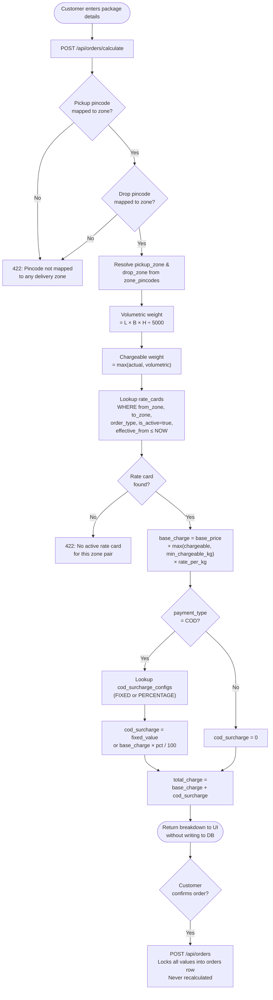
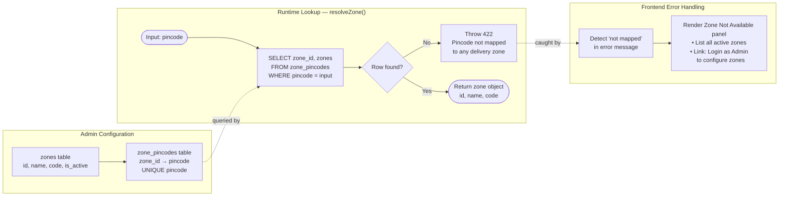
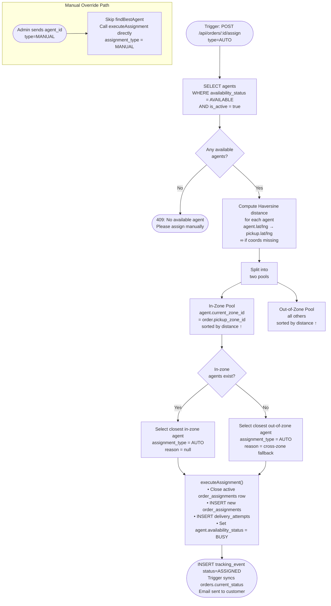
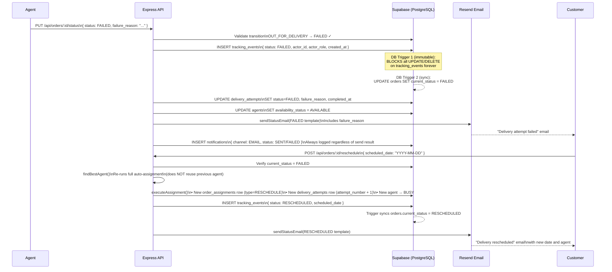

# System Design — Last-Mile Delivery Tracker

> Technical write-up of the four core subsystems, grounded in the actual codebase.
> All table names, field names, and function names reference the real implementation.

---

## 1. Rate Calculation Engine

The engine lives in `server/src/services/rateEngine.js` and `rateCalc.js`. It is invoked on two paths: a **preview call** (`POST /api/orders/calculate`) that writes nothing, and the **order creation call** (`POST /api/orders`) that locks the computed charge permanently into the `orders` record.

### Figure 1 — Rate Calculation Pipeline

**Weight logic** (`rateCalc.js`):
- Volumetric weight: `(length_cm × breadth_cm × height_cm) / 5000`, rounded to 3 dp
- Chargeable weight: `max(actual_weight_kg, volumetric_weight_kg)`
- Base charge: `base_price + max(chargeable_weight_kg, min_chargeable_kg) × rate_per_kg`

The `min_chargeable_kg` field on `rate_cards` prevents under-billing on very light parcels.

**Rate card lookup** filters on `from_zone_id`, `to_zone_id`, `order_type` (B2B/B2C), `is_active = true`, and current timestamp within `effective_from / effective_to`. Intra-zone orders produce a row where `from_zone_id = to_zone_id`. No rate logic exists in application constants — every price is a database row, so an admin can change prices, add zone pairs, or time-bound a promotional rate without a code deployment.

**COD surcharge** is applied only when `payment_type = 'COD'`. The `surcharge_type` column is either `FIXED` (adds a flat rupee amount) or `PERCENTAGE` (adds a fraction of `base_charge`). A database-level constraint (`check_cod_charge`) enforces `cod_surcharge = 0` for all PREPAID orders.

Once confirmed, `base_charge`, `cod_surcharge`, `total_charge`, `rate_card_id`, `volumetric_weight_kg`, and `chargeable_weight_kg` are all written to `orders` and never recalculated — forming a permanent pricing audit trail.

---

## 2. Zone Detection Approach

Zone matching is **pincode-based**, not geo-polygon based. The `zone_pincodes` table maps individual pincode strings to a `zone_id` with a `UNIQUE` constraint on `pincode`, so one pincode belongs to exactly one zone.

### Figure 2 — Zone Detection Flow

On every rate calculation, `resolveZone(pincode)` queries `zone_pincodes` joining `zones`. If no row is found, the function throws immediately with a `422` — there is no silent fallback and the order cannot proceed.

The frontend intercepts this by keyword-matching "not mapped" or "zone" in the error message, then renders a **Zone Not Available** panel showing all configured zones and directing the user to log in as admin.

Admin zone management (`POST /api/zones/:id/pincodes`) accepts an array of pincode strings and bulk-inserts into `zone_pincodes`. Zones carry an `is_active` flag; inactive zones are hidden from non-admin lookups but historical `orders.pickup_zone_id / drop_zone_id` FKs are unaffected.

---

## 3. Auto-Assignment Logic

Auto-assignment is implemented in `server/src/services/autoAssign.js` as `findBestAgent({ pickup_zone_id, pickup_latitude, pickup_longitude })`.

### Figure 3 — Agent Selection Algorithm

**"Available"** means `availability_status = 'AVAILABLE'` AND `is_active = true`. Agents set to `BUSY` (automatically on assignment) or `OFFLINE` (manually via `PUT /api/agents/me/availability`) are excluded at the query level.

The algorithm is two-tiered:
1. **In-zone first** — candidates whose `current_zone_id` matches `pickup_zone_id`, sorted by Haversine distance ascending. The closest wins.
2. **Cross-zone fallback** — if no in-zone agent is available, all remaining available agents sorted by distance. The `order_assignments.reason` field records `"cross-zone fallback — no agent available in pickup zone"` for auditability.

If GPS coordinates are missing for an agent, their distance defaults to `Infinity` and they sort to the end — the algorithm degrades gracefully to zone-only matching rather than erroring.

**Manual override**: `POST /api/orders/:id/assign` with `{ "type": "MANUAL", "agent_id": "<uuid>" }` skips `findBestAgent` entirely and calls `executeAssignment` directly.

---

## 4. Failed Delivery Handling

### Figure 4 — Failed Delivery & Reschedule Sequence

**What happens on FAILED:**
- `VALID_TRANSITIONS` confirms `OUT_FOR_DELIVERY → FAILED` is a legal state change.
- A row is inserted into `tracking_events` with `status`, `actor_id`, `actor_role`, optional GPS, and timestamp. A PostgreSQL trigger (`tracking_events_immutable_update/delete`) permanently blocks any UPDATE or DELETE — the event is sealed at the database level.
- A second trigger (`tracking_events_sync_order_status`) auto-sets `orders.current_status = 'FAILED'`.
- The active `delivery_attempts` row gets `status = 'FAILED'`, `failure_reason`, and `completed_at`.
- The agent's `availability_status` resets to `'AVAILABLE'`.
- `sendStatusEmail` dispatches the FAILED email template via Resend; the send result (success or failure) is always written to `notifications` for audit visibility.

**Reschedule:**
- Customer calls `POST /api/orders/:id/reschedule` with a `scheduled_date`.
- The server re-runs `findBestAgent` from scratch — **the previous agent is not reused**; availability and proximity are re-evaluated at the time of rescheduling.
- A new `order_assignments` row is created (`assignment_type = 'RESCHEDULE'`), a new `delivery_attempts` row with `attempt_number` incremented, and a `RESCHEDULED` tracking event is appended. The order then follows the same lifecycle as the original attempt.
